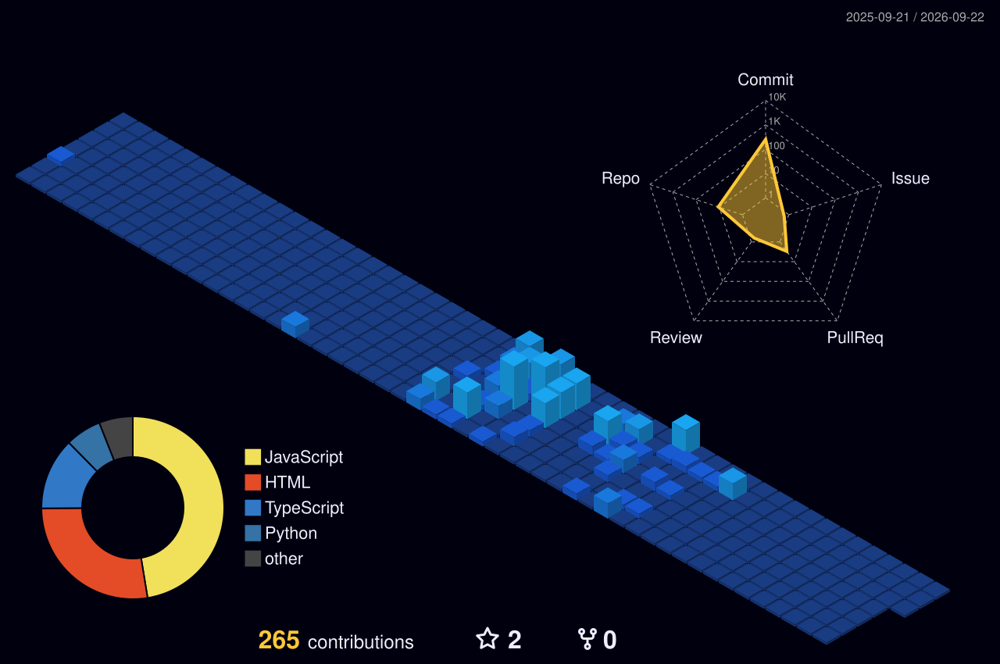

<!-- ═══════════════════════════════════════════════════════════════════════════
     🌊 HEADER — Animated waving gradient banner
     ═══════════════════════════════════════════════════════════════════════════ -->
<div align="center">
  
</div>

<!-- ═══════════════════════════════════════════════════════════════════════════
     ⌨️ TYPING SVG — Animated role descriptions
     ═══════════════════════════════════════════════════════════════════════════ -->
<p align="center">
  <a href="https://git.io/typing-svg">
    
  </a>
</p>

<!-- ═══════════════════════════════════════════════════════════════════════════
     🔗 SOCIAL BADGES — Contact & presence
     ═══════════════════════════════════════════════════════════════════════════ -->
<p align="center">
  <a href="https://linkedin.com/in/steventanardi">
    
  </a>&nbsp;
  <a href="mailto:stevntbankk77@gmail.com">
    
  </a>&nbsp;
  <a href="https://github.com/steventanardi">
    
  </a>&nbsp;
  
</p>

<br />

<!-- ═══════════════════════════════════════════════════════════════════════════
     👨‍💻 ABOUT ME — Terminal / Neofetch style
     ═══════════════════════════════════════════════════════════════════════════ -->

<h2 align="center">
  &nbsp;
  About Me
  &nbsp;
</h2>

<p align="center">
  <em>Passionate <b>Full-Stack Developer</b> and <b>AI Engineer</b> focused on bridging the gap between intelligent LLM-powered systems and elegant web applications. Always eager to build scalable architectures and craft exceptional user experiences.</em>
</p>

```typescript
// steven.profile.ts

export const developerProfile = {
    name: "Steven Tanardi",
    pronouns: ["he", "him"],
    location: "Kinmen, Taiwan 🇹🇼",
    origin: "Indonesia 🇮🇩",
    education: {
        degree: "Master's in Computer Science",
        university: "National Quemoy University (NQU)",
    },
    techFocus: [
        "Advanced LLM Orchestration & RAG Pipelines",
        "Scalable Next.js Architectures",
        "Vector Database Integration",
    ],
    activeProjects: {
        "🎵 Adagio": "AI-powered music platform",
        "🌐 Kinyan": "Full-stack web ecosystem",
        "💼 JobFair": "Career tech platform",
    },
    contact: "stevntbankk77@gmail.com",
};
```

<br />

<!-- ═══════════════════════════════════════════════════════════════════════════
     🛠️ TECH STACK — Organized by category with skill icons
     ═══════════════════════════════════════════════════════════════════════════ -->

<h2 align="center">🛠️ Tech Arsenal</h2>

<div align="center">

<table>
  <tr>
    <td align="center" width="140"><b>💬 Languages</b></td>
    <td align="center">
      <a href="https://skillicons.dev">
        
      </a>
    </td>
  </tr>
  <tr>
    <td align="center" width="140"><b>🧩 Frontend</b></td>
    <td align="center">
      <a href="https://skillicons.dev">
        
      </a>
    </td>
  </tr>
  <tr>
    <td align="center" width="140"><b>⚙️ Backend</b></td>
    <td align="center">
      <a href="https://skillicons.dev">
        
      </a>
    </td>
  </tr>
  <tr>
    <td align="center" width="140"><b>🗄️ Data</b></td>
    <td align="center">
      <a href="https://skillicons.dev">
        
      </a>
    </td>
  </tr>
  <tr>
    <td align="center" width="140"><b>☁️ DevOps</b></td>
    <td align="center">
      <a href="https://skillicons.dev">
        
      </a>
    </td>
  </tr>
</table>

</div>

<br />

---

<!-- ═══════════════════════════════════════════════════════════════════════════
     🏗️ FEATURED PROJECTS — Card-based showcase
     ═══════════════════════════════════════════════════════════════════════════ -->

<h2 align="center">🏗️ Featured Projects</h2>

<div align="center">
  <a href="https://github.com/Steventanardi/Adagio">
    
  </a>&nbsp;&nbsp;
  <a href="https://github.com/Steventanardi/Kinyan">
    
  </a>
</div>

<div align="center">
  <a href="https://github.com/Steventanardi/JobFair">
    
  </a>
</div>

<br />

---

<!-- ═══════════════════════════════════════════════════════════════════════════
     📊 GITHUB STATS & ACTIVITY
     ═══════════════════════════════════════════════════════════════════════════ -->

<h2 align="center">📊 GitHub Analytics</h2>

<div align="center">
  
  
</div>

<br />

<div align="center">
  
</div>

<br />

<!-- ═══════════════════════════════════════════════════════════════════════════
     🌆 3D CONTRIBUTION SKYLINE
     ═══════════════════════════════════════════════════════════════════════════ -->

<h2 align="center">🌆 3D Contribution Skyline</h2>

<div align="center">
  
</div>

<br />

<!-- ═══════════════════════════════════════════════════════════════════════════
     🐍 CONTRIBUTION SNAKE
     ═══════════════════════════════════════════════════════════════════════════ -->

<h2 align="center">🐍 Contribution Snake</h2>

<div align="center">
  <picture>
    <source media="(prefers-color-scheme: dark)" srcset="https://raw.githubusercontent.com/steventanardi/steventanardi/output/github-contribution-grid-snake-dark.svg">
    <source media="(prefers-color-scheme: light)" srcset="https://raw.githubusercontent.com/steventanardi/steventanardi/output/github-contribution-grid-snake.svg">
    
  </picture>
</div>

<br />

---

<!-- ═══════════════════════════════════════════════════════════════════════════
     🏆 GITHUB TROPHIES (Moved to bottom to reduce clutter)
     ═══════════════════════════════════════════════════════════════════════════ -->

<h2 align="center">🏆 Achievements</h2>

<div align="center">
  
</div>

<br />

---

<!-- ═══════════════════════════════════════════════════════════════════════════
     💡 RANDOM DEV QUOTE
     ═══════════════════════════════════════════════════════════════════════════ -->

<h2 align="center">💡 Dev Quote of the Day</h2>

<div align="center">
  
</div>

<br />

<!-- ═══════════════════════════════════════════════════════════════════════════
     🤝 LETS CONNECT
     ═══════════════════════════════════════════════════════════════════════════ -->
<h3 align="center">Let's build something awesome together! 🚀</h3>
<p align="center">
  <a href="mailto:stevntbankk77@gmail.com">
    
  </a>
</p>

<!-- ═══════════════════════════════════════════════════════════════════════════
     🌊 FOOTER — Matching waving gradient
     ═══════════════════════════════════════════════════════════════════════════ -->

<div align="center">
  
</div>
